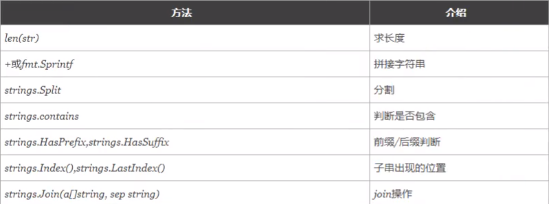

##第一部分：Go语法基础

### 1、经典`Hello World`

#### 1.1、代码：

```go
package main // 声明包名

import "fmt"

func main() { // main为入口函数，无参数，也没有返回值
	fmt.Println("Hello World")
}

```

#### 1.2、编译(正常就直接`go build`)就行了

* 直接在项目目录下`go build`
* `go build -o "xxx.exe"`：这样可以指定名字
* 如果在别的路径下，那么在`GOPATH`后`src`往后写，写到项目目录为止，变异完的项目就在执行编译命令的位置
* `go run main.go`，类似执行脚本文件，就像`python、node`一样
* `go install`,先编译，然后把编译过的文件放到`GOPATH`下的`bin`，里而这个`bin`正好在环境变量里，那么在任何位置都能执行编译好的文件了

### 2、变量和常量

#### 2.1、变量

* 声明：`var s1 string`:`var`是声明，`s1`是名字，`string`是字符串类型的意思
* **切记在函数外面，必须都是以关键字(`var`、`const`、`func`这些)开头的,以及函数内定义的变量必须使用**
* 单独声明

```go
// 声明变量
var name string
var age int
var isOK bool
```

* 批量声明

```go
var (
	name string
	age int
	isOK bool
)
```

* 命名时可以用小驼峰

```go
var studentName string // 这种小驼峰格式的，和js一样
```

* 下面是什么声明时赋值，类型推导，简短变量声明，匿名变量等等，全部写在里面了：

```go
package main

import "fmt" // 导包

// 函数外面只能放一些变量常量的声明，逻辑必须放在代码块里

// 声明变量：声明的名字建议是驼峰命名法
var (
	name        string
	age         int
	isOK        bool
	studentName string // 这种小驼峰格式的，和js一样
)

func foo() (int, string) {
	return 10, "hahaha"
}

func main() { // 入口函数
	// fmt.Println("Hello World")
	name = "hcy"
	age = 19
	isOK = true
	studentName = "huachenyang"
	// go 里变量声明了就要用，不用不给过编译
	fmt.Printf("name:%s", name) // 加了f的是格式化输出，经典%s占位符
	fmt.Println(age)            // 这个是默认加换行的
	fmt.Print(isOK)             // 这个就是单纯的打印
	fmt.Println(studentName)

	// 声明的同时赋值
	var s1 string = "yuki"
	var a1 int = 19
	fmt.Printf("name:%s,age:%d", s1, a1)

	// 类型推导
	var s2 = "haru" // 它可以自己根据值分析自己的类型
	fmt.Println(s2)

	// 简短变量声明
	s3 := "Hello" // 这个就和上面的类型推导相同，不过只能在函数里面用
	fmt.Println(s3)

	// 匿名变量：_
	// 它不占内存空间，不占命名空间，所以也不存在重复命名这回事
	// 主要用来占位，表示忽略值
	x, _ := foo() // 这种来只要一个值的，不要的值就让 _ 接收
	fmt.Println(x)
}

```

* **特别注意,`a := 10`这种简短变量声明只能在函数内使用**

#### 2.2、常量

* 声明关键字是经典的：`const`
* 定义后不能改，**而且一定是一个已经确定的值**
* `iota`是用在常量里的计数器
  * `iota`在`const`关键字出现时被重置为0
  * `const`中每新增**有常量声明的一行**，`iota`才会+1
* 代码示例如下

```go
package main

import "fmt"

const ( // 批量声明常量
	statusOK = 200
	notFound = 404
	forbiden = 403
)

const ( // 这种的，如果第一个写了值，后面三个没这样写，就全和第一个一样
	n1 = 100
	n2
	n3
)

// iota 常量计数器
// 最普通的
const (
	a1 = iota // 0
	a2        // 1
	a3        // 2
)

// 有插队的，还有匿名的
const (
	b1 = iota // 0
	_         // 1被丢弃了
	b2 = iota // 2
	b3 = 100  // 100, 3它不要了
	b4 = iota // 4
)

// 一行多个变量的
const (
	c1, c2 = iota + 1, iota + 2 // 1, 2
	c3, c4 = iota + 1, iota + 2 // 2, 3
)

// 可以把iota单独理解为一个会自增的变量
// 在const那个括号里,第一次出现的时候是 0
// 之后每多出有声明变量的一行,iota的值+1,必须是多出有声明变量的一行,不然iota的值是不会变化的,切记

// iota的一个适用场景
const (
	_  = iota             // 0不要
	KB = 1 << (10 * iota) // 1 << 10,就是左移十位， 10000000000二进制数，就是2^10 也就是1024
	MB = 1 << (10 * iota) // 那么这个就是 2^20， 下面就以此类推
	GB = 1 << (10 * iota)
	TB = 1 << (10 * iota)
	PB = 1 << (10 * iota)
)

func main() {
	fmt.Printf("n1:%d,n2:%d,n3:%d", n1, n2, n3) // n1:100,n2:100,n3:100
	fmt.Println(a1, a2, a3)                     // 0 1 2
	fmt.Println(b1, b2, b3, b4)                 // 0 2 100 4
	fmt.Println(c1, c2, c3, c4)                 // 1 2 2 3
}

```

### 3、基本数据类型

####3.1、整型

| 类型           | 描述                                                   |
| -------------- | ------------------------------------------------------ |
| int8           | 八位整型(-128~127)                                     |
| int16          | 十六位整型(-32768~32767)                               |
| int32          | 三十二位整型(-2147483648~2147483648)                   |
| int64          | 六十四位整型(-9223372036854775808~9223372036854775808) |
| uint8          | 无符号八位整型(0~255)                                  |
| uint16         | 无符号十六位(0~65535)                                  |
| uint32、uint64 | 也是无符号的，和上面两个数据范围同理                   |

* `int`为带符号的整型(正以及0,负各占一半)，`uint`为不带符号的整型(大于等于0)，但是总表示的数都是相同的

* 特殊的情况
  * `int`：在32位系统的机器上为`int32`，在64位机器上为`int64`
  * `uint`：和上面那个一样，32位`uint32`,64位`uint64`
  * `uintptr`:无符号整型，专门用来存内存地址(也就是一个指针)
* **必须强调一点，`int8`,`int16`,`int32`,`int64`是不同类型的数据，千万不要忘记**

**整型的进制：**

* 基本是一个套路的
* 特别强调一点，Go里无法直接定义二进制的数，因此`%b`显示二进制数，这是一个方案
* 八进制:`0`开头，如`012`,十六进制:`0x`开头，如`0x1a`

```go
package main

import "fmt"

func main() {
	// 这玩意不能直接指定二进制的数
	// 十进制
	var a int = 10
	fmt.Printf("%d\n", a) // 十进制在Printf中使用 %d 显示, 结果为：10
	fmt.Printf("%b\n", a) // 转换为二进制 %b, 结果为：1010
	fmt.Printf("%o\n", a) // 转换为八进制 %o, 结果为：12
	fmt.Printf("%x\n", a) // 转换为十六进制 %x, 结果为：a

	// 八进制的定义方式如下,0开头
	b := 021
	fmt.Printf("%d\n", b) // 转换为十进制的结果为：17
	// 十六进制定义方式,0x开头
	c := 0x1d
	fmt.Printf("%d\n", c) // 转换为十进制的结果为：29
}
```

**查看数据类型的`%T`，还有强制数据类型转换**

```go
	// 查看类型 %T ,还有go也是支持强制类型转换的 int8(10), int16(10)这样的
	d := int8(10)
	e := int16(10)
	f := 10
	fmt.Printf("%T\n", d) // int8
	fmt.Printf("%T\n", e) // int16
	fmt.Printf("%T\n", f) // int
```

#### 3.2、浮点型

* **默认的是`float64`，要想有`float32`，那么就要前置转换，`float32(1.23456)`**
* 切记一点，**`float32`和`float64`是完全不同的两种类型，不可进行比较，赋值等一切运算**

```go
package main

import (
	"fmt"
)

func main() {
	a := 1.23456                       // 默认是 float64 类型
	fmt.Printf("a的类型为%T,值为%f\n", a, a) // a的类型为float64,值为1.234560

	b := float32(1.23456)              // 想要用float32，就要明确写出来
	fmt.Printf("b的类型为%T,值为%f\n", b, b) // b的类型为float32,值为1.234560

	// b = a // 这是不行的，类型不同 float32和float64是完全不相同的两种类型
}

```

#### 3.3、复数

```go
package main

import "fmt"

func main() {
	// 下面是复数的定义法，就没见过用这种东西
	var c1 complex64 = 1 + 2i  // complex64的实部和虚部都是32位的
	var c2 complex128 = 2 + 3i // complex128的实部和虚部都是64位的

	fmt.Println(c1) // (1+2i)
	fmt.Println(c2) // (2+3i)
}

```

#### 3.4、布尔值

**Go里面使用`bool`类型声明布尔型数据，只有`true`和`false`**

* 布尔类型变量默认是`false`，也就是声明了一个`bool`类型的变量，不赋值，默认是`false`
* **Go中不允许将整型强制转换为布尔型**
* 布尔型无法参数数值运行，也无法与其它类型进行转换

```go
package main

import "fmt"

func main() {
	var b1 bool // 默认是 false
	b2 := true

	// %v 任何类型的值都可以匹配打印出来
	fmt.Printf("b1类型为：%T,b1的值为%v\n", b1, b1) // b1类型为：bool,b1的值为false
	fmt.Println(b2)                          // true
}

```

* **补充：`%v`，可以匹配打印出任何类型的值**

### 4、`fmt`%占位符的总结

```go
package main

import "fmt"

func main() {
	// fmt占位符总结
	var n int = 100
	var s string = "go python javascript,未完待续..."

	fmt.Printf("%T\n", n) // %T 数据类型,结果为：int
	fmt.Printf("%T\n", s) // 结果为：string

	fmt.Printf("%b\n", n) // %b 二进制数,结果为：1100100
	fmt.Printf("%d\n", n) // %d 十进制,结果为：100
	fmt.Printf("%o\n", n) // %o 八进制,结果为：144
	fmt.Printf("%x\n", n) // %x 十六进制,结果为：64

	fmt.Printf("%s\n", s)  // %s 字符串,结果为：go python javascript,未完待续...
	fmt.Printf("%v\n", s)  // %v 任何类型的值都可以匹配,结果为：go python javascript,未完待续...
	fmt.Printf("%#v\n", s) // %#v 对那个类型的变量的值做一些修饰(字符串会多出""),结果为："go python javascript,未完待续..."
	fmt.Printf("%#v\n", n) // (整型好像没什么变化)结果为：100
}

```

### 5、字符串

* 这个得拎出来单独说

#### 5.1、简要说明

* Go中字符串使用**`UTF-8`**编码，字符串的值为双引号`""`里的内容，`''`单引号里的那个叫单个字符
  * `UTF-8`中一般常用的汉字占`3`个字节(byte)
* Go中源码可以直接添加非`ASCII`码的字符

#### 5.2、一些方法

* **记得一定要把`strings`包导进来**
* **切记`strings`里的方法第一个字母全是大写的，而且是`strings`，不是`string`**



```go
package main

import (
	"fmt"
	"strings"
)

func main() {
	// 1、转义(经典套路)是 \
	var s1 string = "\"就要打印一下双引号\""
	var s2 string = "打印反斜杠\\"
	fmt.Println(s1) // "就要打印一下双引号"
	fmt.Println(s2) // 打印反斜杠\

	// 2、模板字符串 ``
	s3 := `
		<h1>有点类型js里的模板字符串</h1>
		<p>看看打印出来的结果吧</p>
	`
	fmt.Println(s3) // 很像js里的模板字符串，可惜不支持${}

	// <h1>有点类型js里的模板字符串</h1>
	// <p>看看打印出来的结果吧</p>

	// 3、一些方法
	name := "hcy"
	age := "19"
	test := "Hello Go Python Javascript"
	// len():这个比较通用
	fmt.Println(len(name)) // 3

	// fmt.Sprintf():拼接字符串
	me1 := fmt.Sprintf("%s %s", name, age)
	fmt.Println(me1) // hcy 19

	// + 加号拼接字符串
	me := "名字：" + name + "年龄：" + age
	fmt.Println(me) // 名字：hcy年龄：19

	// strings.Split():分割字符串为数组
	// 第一个参数是指定分割的字符串。第二个是指定以什么去分割
	testList := strings.Split(test, " ") // [Hello Go Python Javascript]
	fmt.Println(testList)                // 用空格分割字符串test

	// strings.contains():是否包含，返回bool值
	fmt.Println(strings.Contains(test, "Go"))   // true
	fmt.Println(strings.Contains(test, "1223")) // false

	// strings.HasPrefix():判断开头，strings.HasSuffix():判断结尾
	fmt.Println(strings.HasPrefix(test, "Hell"))   // true
	fmt.Println(strings.HasSuffix(test, "script")) // true

	// strings.Index():求索引,strings.LastIndex():最后一次出现的索引
	fmt.Println(strings.Index(test, "Go"))    // 6
	fmt.Println(strings.Index(test, "o"))     // 4
	fmt.Println(strings.LastIndex(test, "o")) // 13

	// strings.Join()拼接
	fmt.Println(strings.Join(testList, "++")) // Hello++Go++Python++Javascript
}

```

####5.3`[]rune`和`[]byte`以及字符串的修改

* `rune`本质是`int32`
* `byte`本质是`uint8`

```go
package main

import "fmt"

func main() {
	str := "你好 world"
	fmt.Printf("len(str) = %d,类型为%T\n", len(str), str) // len(str) = 12,类型为string
	// 确实是符合UTF-8编码的，一个中文字符一般占3个字节，展示出来的就是3个字符长度

	str1 := []int32(str)
	str2 := []rune(str)
	fmt.Printf("len(str1) = %d,类型为%T,值为%c\n", len(str1), str1, str1) // len(str1) = 8,类型为[]int32,值为[你 好   w o r l d]
	fmt.Printf("len(str2) = %d,类型为%T,值为%c\n", len(str2), str2, str2) // len(str2) = 8,类型为[]int32,值为[你 好   w o r l d]
	// 既然一个UTF-8是3个字符长度，那么使用int32就能很好的去储存，那么现在的长度就是8了
	// 而且可以证明 []int32和[]rune 是一样的，我试了 []int16，报错了

	str3 := []uint8(str)
	str4 := []byte(str)
	fmt.Printf("len(str3) = %d,类型为%T,值为%c\n", len(str3), str3, str3) // len(str3) = 12,类型为[]uint8,值为[ä ½   å ¥ ½   w o r l d]
	fmt.Printf("len(str4) = %d,类型为%T,值为%c\n", len(str4), str4, str4) // len(str3) = 12,类型为[]uint8,值为[ä ½   å ¥ ½   w o r l d]
	// 这里可以看到 []uint8 和 []byte 是一样的,而且结果发生了乱码

	// 而且可以看到不管是 []rune 还是 []byte,它们都是把字符串分成了一个数组

	// 字符串的修改
	// str1[0] = '人' // 字符串默认不能修改，这个虽然没有报错，但是
	// fmt.Printf("%s\n", str) // 你好 world,没有发生改变

	// 字符串的修改方案(尤其是还有中文等各国语言时的情况)
	str5 := "いま、私はGoを学んでいる"
	str6 := []rune(str5) // 由于字符串不能修改，这就是在重新开辟一块内存空间储存这个 []rune 后的结果
	// 然后对结果进行修改，之后再转回 string 就能获取修改后的数组
	fmt.Printf("%c\n", str6) // [い ま 、 私 は G o を 学 ん で い る]
	str6[3] = '我'
	fmt.Printf("%s\n", string(str6)) // いま、我はGoを学んでいる
}

```

**综合练习：判断是否为回文**

```go
func isSameText(text string) (result bool) {
	textList := []rune(text)
	// fmt.Printf("%T,%v,%d,%d\n", textList, textList, len(textList), cap(textList))
	result = false
	left := 0
	right := len(textList) - 1
	for left <= right {
		if textList[left] != textList[right] {
			return
		}
		left++
		right--
	}
	result = true
	return
}

func main() {
	var str1 = "晴天天晴"
	var str2 = "晴天不天晴"
	var str3 = "晴天不是天晴"

	fmt.Println(isSameText(str1)) // true
	fmt.Println(isSameText(str2)) // true
	fmt.Println(isSameText(str3)) // false
}
```

#### 5.4、字符，字符串，字节的区别

* 字符：使用`''`单引号包裹的，单个的字母，符合，或者文字(各种语言都可以)
* 字符串：使用`""`双引号包裹的，里面的内容没有特别的限制
* 字节：一个`byte`，也就是8个`bit`，`1byte == 8bit`
  * 一个`bit`就是0或1的二进制数

### 6、强制数据类型转换

```go
package main

import "fmt"

func main() {
	var num1 float64
	num2 := 100
	// num1 = num2 // 这明显是要报错的，因为类型不对，float64怎么接收int的值呢
	// 这时就可以用到强制类型转换
	num1 = float64(num2)
	fmt.Printf("num1的值为%f,类型为%T", num1, num1) // num1的值为100.000000,类型为float64
}

```

### 7、控制流程

#### 7.1、`if / else if / else`

```go
// 1、if / else if / else (学一下写法，套路都一样)
age := 18
if age < 18 {
	fmt.Println("小屁孩不要来上网")
} else if age > 18 {
	fmt.Println("xxx网咖欢迎光临")
} else {
	fmt.Println("刚满18就来上网？？？") // 刚满18就来上网？？？
}
fmt.Println(age) // 18

// 还有一个类似js中let块作用域的东西
// 写法是用一个分号; 隔开,然后在if这个控制语句内 sex := 3 变量有效
if sex := 3; sex == 0 {
	fmt.Println(sex, "女")
} else if sex == 1 {
	fmt.Println(sex, "男")
} else {
	fmt.Println(sex, "性别未知") // 3 性别未知
}
// fmt.Println(sex) // 报错，undefined
```

#### 7.2、`for`

* Go里面是没有`while`的
* `for`有很多变种

```go
// 2、for 的基本写法
for i := 0; i < 10; i++ {
	fmt.Printf("%d ", i) // 0 1 2 3 4 5 6 7 8 9
}
// fmt.Println(i) // 报错undefined，同样是块作用域

// 2.1、省略赋值语句，也就是写在外面
j := 0
for ; j < 10; j++ {
	fmt.Printf("%d ", j) // 0 1 2 3 4 5 6 7 8 9
}
fmt.Println(j) // 10,这个j就不是块作用域了

// 2.2、就写个条件在外面
x := 5
for x < 10 {
	fmt.Printf("%d ", x) // 5 6 7 8 9
	x++
}

// 2.3、无限死循环
// for {
// 	fmt.Println("11")
// }

// 2.4、for index, item := range 变量 {}
// 这也是一种循环写法,下面拿一个字符串举例
var str string = "学习Go"
for index, item := range str {
	fmt.Printf("索引%d的字符为%c\n", index, item)
}
// 索引0的字符为学
// 索引3的字符为习
// 索引6的字符为G
// 索引7的字符为o
// 因为一个汉字的UTF-8编码的长度是3个字节

// 经典九九乘法表
for a := 1; a < 10; a++ {
	for b := 1; b < a+1; b++ {
		fmt.Printf("%d * %d = %d\t", b, a, a*b)
	}
	fmt.Printf("\n")
}
// 1 * 1 = 1
// 1 * 2 = 2       2 * 2 = 4
// 1 * 3 = 3       2 * 3 = 6       3 * 3 = 9
// 1 * 4 = 4       2 * 4 = 8       3 * 4 = 12      4 * 4 = 16
// 1 * 5 = 5       2 * 5 = 10      3 * 5 = 15      4 * 5 = 20      5 * 5 = 25
// 1 * 6 = 6       2 * 6 = 12      3 * 6 = 18      4 * 6 = 24      5 * 6 = 30      6 * 6 = 36
// 1 * 7 = 7       2 * 7 = 14      3 * 7 = 21      4 * 7 = 28      5 * 7 = 35      6 * 7 = 42      7 * 7 = 49
// 1 * 8 = 8       2 * 8 = 16      3 * 8 = 24      4 * 8 = 32      5 * 8 = 40      6 * 8 = 48      7 * 8 = 56      8 * 8 = 64
// 1 * 9 = 9       2 * 9 = 18      3 * 9 = 27      4 * 9 = 36      5 * 9 = 45      6 * 9 = 54      7 * 9 = 63      8 * 9 = 72      9 * 9 = 81
```

* **重点记一下`for index, item := range 变量 {}`**

#### 7.3、`break`和`continue`

```go
	// 1、break , continue
	// 直接跳出循环的方法，也就是使用 break
	// 跳过当次循环的方法，也就是使用 continue
	for i := 0; i < 10; i++ {
		if i == 5 {
			break // 在i为5的时候跳出循环
			// continue // 在i为5时不执行这句循环里的代码直接跳过
		}
	}
```

#### 7.4、`switch`

```go
	// 2、switch
	// 这用法不会有区别的，看看go怎么写的就好了
	n := 0
	switch n {
	case 3:
		fmt.Printf("n是3\n")
	case 4:
		fmt.Printf("n是4\n")
	case 5:
		fmt.Printf("n是5\n")
	default: // 设置默认值
		fmt.Printf("n未知\n")
	}

	// go里的switch在变量处可以赋值，case可以匹配多个值
	switch i := 3; i {
	case 1, 2, 3:
		fmt.Println("i是1,2,3里的一个")
	case 4, 5, 6:
		fmt.Println("i是4,5,6里的一个")
	}

	// go里的switch里的case还可以匹配表达式
	// 不过这种写法的话，switch 后面不要写变量
	j := 10
	switch { // 这个后面不要写变量
	case j < 5:
		fmt.Println("j在5以内")
	case j >= 5 && j <= 15:
		fmt.Println("j在5到15之间")
	case j > 15:
		fmt.Println("j大于15")
	}

	// go 里可以认为 case 匹配到一个就会马上结束，就不像js，c，c++一样还往下接着穿透
	// 但是如果就想它接着往下穿透，那么有一个关键字 fallthrough 可以解决这个问题
	x := 10
	switch {
	case x > 5:
		fmt.Println(">5")
		fallthrough // 没有这句的话只会打印 >5 ，有fallthrough后还会打印 >7
	case x > 7:
		fmt.Println(">7")
	case x > 10:
		fmt.Println(">10")
	}
```

* 结果展示：

```powershell
n未知
i是1,2,3里的一个
j在5到15之间
>5
>7
```


#### 7.5、`goto`

```go
	// goto
	// 直接把代码给引导到另外的位置
	// 下面展示一个循环里的用法
	for i := 0; i < 3; i++ {
		for j := 0; j < 3; j++ {
			if i == 1 && j == 1 {
				goto routerMark // 写指向的标签名
			}
			fmt.Println(i, j)
		}
	}

routerMark: // 直接写标签名: 后面接上想要写的代码
	fmt.Println("给我跳")
```

* 结果展示：

```powershell
0 0
0 1
0 2
1 0
给我跳
```

### 8、运算符

#### 8.1、算术、比较、逻辑运算符

**1. 这个真的是一个套路，主要说一说要注意的点：**

**除法运算、求余运算、比较运算：**

```go
	var a int16 = 20
	var b int16 = 30
	var c int64 = 20
	var d int64 = 50

	fmt.Println(a == b) // false
	// fmt.Println(a == c) // 直接报错，类型不同，不可以运算

	// fmt.Println(a * c) // 仍然是因为类型问题而报错
	fmt.Println(a * b) // 600

	fmt.Println(d / c) // 2

	fmt.Println(d % c) // 10

	// var e int64 = d++ // 还是报错，Go里 d++/++d 这种是语句，不能作为表达式用
	// fmt.Println(d++) // 同样是报错的
```

* 特别注意的点如下：
  * Go的强类型...，强的有点超出我的想象了(毕竟一直是在写JavaScript和Python)，`int16`和`int64`都是完全不同的两个类型，无法一起运算
  * 判断是否全等，`==`等号两个就够了
  * **`变量++`或`++变量`这种是一句语句，无法作为表达式使用(比如赋值什么的)**

**2. 逻辑运算`&&`,`||`,`!`这经典的三个运算符**

#### 8.2、位运算符

**位运算符是针对二进制数的运算**

- `&`:按位与
- `|`:按位或
- `^`:按位异或
- `<<`:向左移相应位数，就是在后面加0
- `>>`:向右移相应位数，在后面减去相应位数，超过总位数的话直接归零

```go
// 位运算符(针对2进制)
fmt.Printf("直接写一个数的类型是：%T\n", 2) // 直接写一个数的类型是：int，那么按照64位系统来，就是64位

// & 按位与，比如(二进制) 101 和 10
// 第一位 1 和 0， 1 & 0 = 0
// 第二位 0 和 1， 0 & 1 = 0
// 第三位 1 和 无，1 & 无 = 0
fmt.Printf("5 & 2 = %b\n", 5&2) // 5 & 2 = 0

// | 按位或，还是用(二进制) 101 和 10
// 第一位 1 或 0， 1 | 0 = 1
// 第二位 0 或 1， 0 | 1 = 1
// 第三位 1 或 无，1 | 无 = 1
fmt.Printf("5 | 2 = %b\n", 5|2) // 5 | 2 = 111

// ^ 按位异或，继续(二进制) 101 和 10
// 第一位 1 异或 0，1 和 0 不同， 1 ^ 0 = 1
// 第二位 0 异或 1，0 和 1 不同， 0 ^ 1 = 1
// 第三位 1 异或 无，1 和 无 不同，1 ^ 无 = 1
fmt.Printf("5 ^ 2 = %b\n", 5^2) // 5 ^ 2 = 111

// << 位数左移， 使用(二进制) 1
// 1 << 10,1左移10位就是在1后面加10个0，即：10000000000
fmt.Printf("1 << 10 = %b = %d\n", 1<<10, 1<<10) // 1 << 10 = 10000000000 = 1024

// >> 位数右移，用(二进制) 1010
// 1010 >> 2,右移2位，即：10
// 1010 >> 3 : 1
// 1010 >> 4,一位也不剩了，右移的位数大于总位数的话，移多少位都是0
fmt.Printf("10 >> 2 = %b = %d\n", 10>>2, 10>>2) // 10 >> 2 = 10 = 2
fmt.Printf("10 >> 4 = %b = %d\n", 10>>4, 10>>4) // 10 >> 4 = 0 = 0
fmt.Printf("10 >> 5 = %b = %d\n", 10>>5, 10>>5) // 10 >> 5 = 0 = 0

// 因为这些数字，默认是 int 型，也就是随(64位)系统默认是，是int64(但是和直接写出来的int64不同)
// 如果 int8，左移一些位数后总位数大于8了，多出来的也取不到，算不进去
// 同理，int16,32,64，分别是最大16位，32位，64位二进制数
// m := int8(1) << 10 // 直接报错，1024 overflows int8，位数超了，算不了
// fmt.Printf("int8的1，1 << 10 = %b", m)
```

#### 8.3、赋值运算符

**直接展示位运算的赋值运算符，别的没什么意义，一个套路的**

```go
// 赋值运算符
// -=，+=，*=，/=，%=，这5个都是一个套路的
// 简单写一写位运算的赋值运算
o := 10 // 1010
p := 2  // 10
// o &= p
// fmt.Printf("%b = %d\n", o, o) // 10 = 2
o |= p
fmt.Printf("%b = %d\n", o, o) // 1010 = 10
// >>=, <<=, ^= 也是同理的
```

## 第二部分：复合数据类型

### 1、数组

#### 1.1、数组的初始化

**注意: `[20]int`、`[30]int`，虽然都是`int`，但是长度不同，也是不同的类型**

```go
var arr1 [3]int16
var boolArr [3]bool
// 数组定义时，要指明数组长度，还有类型，[长度]类型
fmt.Printf("%v,type:%T\n", arr1, arr1)       // [0 0 0],type:[3]int16
fmt.Printf("%v,type:%T\n", boolArr, boolArr) // [false false false],type:[3]bool
// 数组的类型打印出来，会带上长度 [length]type, 这就是数组的类型

// 下面是数组初始化的方法，可以直接这样写: [length]type{...value}
arr2 := [4]int{1, 2, 3, 4}
fmt.Printf("%v,type:%T\n", arr2, arr2) // [1 2 3 4],type:[4]int

// 给数组指定的索引处响应的值
// 写法：[length]type{index: value,...}
arr3 := [5]int{0: 1, 2: 2, 4: 3}
fmt.Printf("%v,type:%T\n", arr3, arr3) // [1 0 2 0 3],type:[5]int
// 没有指定的就是 0

// 如果太长，或者就是不想写length，可以直接写三个点： ...
// 但是这种情况是必须已经明确把数组里有数据给写出来了
arr4 := [...]int{1, 3, 5, 7, 9}
fmt.Printf("%v,type:%T\n", arr4, arr4) // [1 3 5 7 9],type:[5]int

arr5 := [...]int{1: 3, 5: 9}           // 这样写也可以，长度会自动计算出来，没指定的用0补全
fmt.Printf("%v,type:%T\n", arr5, arr5) // [0 3 0 0 0 9],type:[6]int
```

#### 1.2、数组的遍历

```go
// 数组的遍历
citys := [...]string{"芜湖", "六安", "合肥"}

// 最基本的索引遍历
for i := 0; i < len(citys); i++ {
	fmt.Println(citys[i])
}
// 芜湖
// 六安
// 合肥

// range遍历
for index, value := range citys {
	fmt.Printf("索引为%d的值为%v\n", index, value)
}
// 索引为0的值为芜湖
// 索引为1的值为六安
// 索引为2的值为合肥
```

#### 1.3、二维数组

**注意：**

- 多维数组，只有最外层可以写`[...]`
- 下面这个，可以写成`[3][2]int`，也可以是`[...][2]int`，但是`[...][...]int`是不可以的

```go
// 二维数组
var items [3][2]int
items = [3][2]int{
	[2]int{1, 2},
	[2]int{3, 4},
	[2]int{5, 6}, // 记得最后一行这里，一定要加上逗号`,`，不然是会报错的
}
for _, value1 := range items {
	for _, value2 := range value1 {
		fmt.Println(value2)
	}
}
// 1
// 2
// 3
// 4
// 5
// 6
```

#### 1.4、Go里的数组要注意的点

**1. Go里的数组是值类型(不是引用类型)**

- 数组是值类型
- 与js不同，这里的数组是值类型，是可以使用 ==，!= 这些比较运算符的
- 由于是值类型，并非是引用类型，那么这里使用数组，根本不用考虑不同的变量指在同一个数组的地址值这些东西，根本就不存在

```go
var c1 [3]int = [3]int{4, 5, 6}
c2 := c1
c2[1] = 50
fmt.Printf("c1:%v,c2:%v", c1, c2) // c1:[4 5 6],c2:[4 50 6]
// c2改变，与c1无关，因为是值类型，两者是处在不同内存地址，互相独立的
```

**2. 还是数据类型，数据类型必须完全一致**

### 2、切片

#### 2.1、切片的基本理解

* 对数组进一步封装，使其变成一个**长度不受限制**的存储**相同类型**数据的一个数据结构
* 声明和初始化的语法：`var s1 []int = []int{...}`，不再需要指明长度，只要把类型写出来就行了
* 切片是引用数据类型，如果只声明，没有在里面存值，那么就是`nil`，和别的语言`null`一个意思

```go
var s1 []int           // 切片不需要指明长度，而且是引用数据类型
fmt.Printf("%v\n", s1) // []
// nil就是空，和别的语言null相同
fmt.Printf("%v\n", s1 == nil) // true

s2 := []int{1, 2, 3}
fmt.Printf("切片s2的长度:%d\n", len(s2))      // 切片s2的长度:3
fmt.Printf("切片s2的值:%v,类型为:%T\n", s2, s2) // 切片s2的值:[1 2 3],类型为:[]int
```

#####2.1.1、切片还可以通过数组切割获得

```go
// 切片可以以一个数组作为其依据的底层数组
arr := [...]int{1, 3, 5, 7, 9, 11}
// arr[start, end] 遵从左闭右开的规则
s3 := arr[1:3]
s4 := arr[:3]
s5 := arr[3:]
fmt.Printf("%v为len(s3):%d,cap(s3):%d\n", s3, len(s3), cap(s3)) // [3 5]为len(s3):2,cap(s3):5
fmt.Printf("%v为len(s4):%d,cap(s4):%d\n", s4, len(s4), cap(s4)) // [1 3 5]为len(s4):3,cap(s4):6
fmt.Printf("%v为len(s5):%d,cap(s5):%d\n", s5, len(s5), cap(s5)) // [7 9 11]为len(s5):3,cap(s5):3
```

- `arr[start, end]`遵从左闭右开的规则
- s3的cap容量为5，s4的cap容量为6，而s5的cap容量为3
- **说明cap的算法是以其依赖的数组的长度的，算法为`start`到`len(arr)`之间有的数组成员的数量**,和`end`没什么关系

#####2.1.2、还有切片切割出来的切片

```go
arr := [...]int{1, 3, 5, 7, 9, 11}
s4 := arr[:3]
fmt.Printf("%v为len(s4):%d,cap(s4):%d\n", s4, len(s4), cap(s4)) // [1 3 5]为len(s4):3,cap(s4):6
s7 := s4[1:]
fmt.Printf("%v为len(s7):%d,cap(s7):%d\n", s7, len(s7), cap(s7)) // [3 5]为len(s7):2,cap(s7):5
```

- 因为`s7`所依赖的底层数组仍然是`arr`,所以任然遵守`start`到`len(arr)`的原则，`cap(s7)`为5

#####2.1.3、由于切片是引用数据类型，而且依赖于一个底层数组，那么通过修改底层数组，观察依赖它的切片的变化

```go
arr1 := [...]int{1, 2, 3, 4}
sli1 := arr1[:2]
sli2 := sli1[:1]
fmt.Printf("修改前的,sli1:%v,sli2:%v\n", sli1, sli2) // 修改前的,sli1:[1 2],sli2:[1]
arr1[0] = 100
fmt.Printf("修改后的,sli1:%v,sli2:%v\n", sli1, sli2) // 修改后的,sli1:[100 2],sli2:[100]
```

- 可以发现，底层数组的数据变化，那么依赖它的切片全部跟着变化
- 如果通过切片修改值，实际上就是在修改底层数组里的值，切片和底层数组双向影响

#####2.1.4、如果修改切片的数据，那么由这个切片再切出来的切片也会发生变化

```go
arr1 := [...]int{1, 2, 3, 4}
sli1 := arr1[:2]
sli2 := sli1[:1]
fmt.Printf("修改前的,sli1:%v,sli2:%v\n", sli1, sli2) // 修改前的,sli1:[1 2],sli2:[1]
sli1[0] = 100
fmt.Printf("修改后的,sli1:%v,sli2:%v\n", sli1, sli2) // 修改后的,sli1:[100 2],sli2:[100]
```

####2.2、切片的`len`和`cap`

**1. 声明后直接赋值的切片，`len`和`cap`相等**

```go
s2 := []int{1, 2, 3}
fmt.Printf("len(s2):%d,cap(s2):%d\n", len(s2), cap(s2)) // len(s2):3,cap(s2):3
```

**2. 切片可以以一个数组作为其依据的底层数组**

- 这种切片的`len`按照一般理解的方式是没有问题的
- 但是`cap`就不同了，是依赖于当前的数组的，下面是这种情况下的`len`和`cap`

```go
arr := [...]int{1, 3, 5, 7, 9, 11}
s4 := arr[:3]
fmt.Printf("%v为len(s4):%d,cap(s4):%d\n", s4, len(s4), cap(s4)) // [1 3 5]为len(s4):3,cap(s4):6
s7 := s4[1:]
fmt.Printf("%v为len(s7):%d,cap(s7):%d\n", s7, len(s7), cap(s7)) // [3 5]为len(s7):2,cap(s7):5
```

#### 2.3、切片的原理

**切片的本质：**

- 一个框，框住了一块连续的内存，它里面只能存同类型的值
- 切片是引用类型，真正的值是在底层数组里
  - **由于是引用数据类型，因此切片之间无法使用`==`,`!=`这些比较运算符，但是可以和`nil`使用这些比较运算符**

#### 2.4、`make()`函数创造切片

- 语法：`make(type, len, cap)`
  - `cap`为底层数组长度
  - `len`为切片长度，初始化出来的，全部用0填充
- `make`函数创造的切片，是一定有底层数组的，因此就算`len`和`cap`都是0，初始化出来的切片也不是`nil`
- `var 变量 type`声明的切片，在没有赋值前，是没有底层数组的，因此是`nil`

```go
// make() 函数创建切片
// 下面是初始化
s1 := make([]int, 5, 10) // type, len, cap
fmt.Printf("s1:%v, len(s1):%d, cap(s1):%d\n", s1, len(s1), cap(s1))
// s1:[0 0 0 0 0], len(s1):5, cap(s1):10
// 可以发现s1为容量10长度5的切片，值全部由0填充

// make出来的切片，一定是有底层数组的，就算是空的，切片也不为 nil
s2 := make([]int, 0, 0)
fmt.Printf("s2:%v, len(s2):%d, cap(s2):%d\n", s2, len(s2), cap(s2))
// s2:[], len(s2):0, cap(s2):0
fmt.Println(s2 == nil) // false

// 直接声明出来的切片，没有赋值时，没有底层数组，因此为 nil
var s3 []int
fmt.Printf("s3:%v, len(s3):%d, cap(s3):%d\n", s3, len(s3), cap(s3))
// s3:[], len(s3):0, cap(s3):0
fmt.Println(s3 == nil) // true
```

####2.5、切片的拷贝赋值

```go
// 下面还是通过切片的赋值拷贝继续证明切片为引用数据类型
s4 := []int{1, 2, 3}
s5 := s4 // s4和s5指向相同的内存地址，因此改s5时，s4也变
// 其实本质是改掉了它们共同所指的那块内存里的值
fmt.Println(s4, s5) // [1 2 3] [1 2 3]
s5[0] = 100
fmt.Println(s4, s5) // [100 2 3] [100 2 3]
```

#### 2.6、切片的遍历

```go
// 切片遍历
s6 := []int{1, 2, 3}

// 索引遍历
for i := 0; i < len(s6); i++ {
	fmt.Println(s6[i])
}
// 1
// 2
// 3

// range遍历
for index, value := range s6 {
	fmt.Println(index, value)
}
// 0 1
// 1 2
// 2 3
```

### 3、`append`,为切片追加元素

#### 3.1、`append`追加元素时`cap`的处理

#####3.1.1、 源码：

```go
newcap := old.cap // 新的newcap = 2 * 原先的cap
doublecap := newcap + newcap
if cap > doublecap { // 如果新申请的newcap*2小于原先的oldcap，那么cap不变
	newcap = cap
} else {
	if old.len < 1024 { // 如果旧切片的长度小于1024,那么新的newcap为原先oldcap的二倍
		newcap = doublecap
	} else {
		// Check 0 < newcap to detect overflow
		// and prevent an infinite loop.
        // newcap大于0且小于原先cap，循环执行newcap += newcap / 4,到newcap >= oldcap为止
		for 0 < newcap && newcap < cap {
			newcap += newcap / 4
		}
		// Set newcap to the requested cap when
		// the newcap calculation overflowed.
		if newcap <= 0 { // 如果新的newcap小于等于0，那么cap不变
			newcap = cap
		}
	}
}
```

**先后判断顺序：**

* 如果新申请的`newcap*2`小于原先的`oldcap`，那么`cap`不变
* 如果旧切片的长度小于1024,那么新的`newcap`为原先`oldcap`的二倍
* `newcap`大于0且小于原先`cap`，循环执行`newcap += newcap / 4`,到`newcap >= oldcap`为止
  * 注意一点，是每次在**已经增加的基础上**再增加`1/4`
* 如果新的`newcap`小于等于0，那么`cap`不变

**在补充说明一点，扩容的值类型不同，扩容策略也有区别**

#####3.1.2、 示例：

```go
// append 为切片追加元素
s1 := []string{"芜湖", "合肥", "六安"}
fmt.Printf("len:%d,cap:%d\n", len(s1), cap(s1)) // len:3,cap:3
// s1[3] = "上海" // panic: runtime error: index out of range [3] with length 3
// 这种情况，编译时才会报错，索引越界了

// append函数语法: 原切片变量 = append(原切片变量, 新的元素)
// 注意一点，append函数的结果，必须使用原追加元素的切片变量去接收
s1 = append(s1, "上海")
fmt.Printf("len:%d,cap:%d\n", len(s1), cap(s1)) // len:4,cap:6
// 从源码开来，这里应该是进入了 old.len < 1024 里,然后执行了 newcap = doublecap,因此cap是翻倍了
fmt.Printf("s1:%v\n", s1) // s1:[芜湖 合肥 六安 上海]
```

#####3.1.3、 `slice变量名...`为拆开切片，这样可以一次性`append`多个元素

- 当然直接在`append`后面多写几个参数传入也是可以的

```go
// 一次性 append 多个
// 拆开切片的方式, `slice变量名...`
s2 := []int{1, 2, 3}
fmt.Printf("len:%d,cap:%d\n", len(s2), cap(s2)) // len:3,cap:3
s3 := []int{4, 5, 6, 7, 8}
s2 = append(s2, s3...)
fmt.Printf("len:%d,cap:%d\n", len(s2), cap(s2)) // len:8,cap:8
// 这种情况下，新申请的 cap 应该是 4
```

#### 3.2、`append`还可以自动初始化没有初始化的切片变量

```go
var a []int
fmt.Printf("value:%v,len:%d,cap:%d\n", a, len(a), cap(a)) // value:[],len:0,cap:0
a = append(a, 1, 2, 3)
fmt.Printf("value:%v,len:%d,cap:%d\n", a, len(a), cap(a)) // value:[1 2 3],len:3,cap:4
```

- 可以看到，`var`出来的切片变量，刚刚开始是`nil`，但是使用`append`追加元素后，它会被自动初始化，也就是分配到相应的内存空间

###4、`copy`，针对引用数据类型切片的拷贝

- 把`a`里的值拷贝到`b`里去:`copy(b, a)`
- 语法：`copy(目标切片, 原切片)`
- 这样两个切片各种都是一块独立的内存空间，互相不会产生影响了
- 使用`copy`时，`目标切片`一定要是`make`出来的，不然没有内存空间，就是`nil`,那样是拷贝不进去的
  - 也就是说，直接`var`声明变量，没有初始化的话，`copy`后还是`[]`，也就是`nil`
- 而且`copy`也不会帮你自动扩容，那么目标切片一定是要大于等于原切片的长度(`len`)
  - 拷贝时只会替换索引相同的值，目标切片后面多出来的是不变的

```go
// 赋值拷贝的方式
s1 := []int{1, 2, 3}
s2 := s1
fmt.Println(s1, s2) // [1 2 3] [1 2 3]
s2[0] = 100
fmt.Println(s1, s2) // [100 2 3] [100 2 3]
// 由于切片是引用数据类型，这种赋值拷贝方式，修改时只是在改同一块内存空间里的数据
// 因此通过一个变量改了值后，另一个变量取值时，会取到已修改后的值

// copy 拷贝的方式
// 这种方式需要先用make函数创建一个切片出来
s3 := []int{4, 5, 6}
s4 := make([]int, 3, 3)
copy(s4, s3) // 把 s3 里的数据拷贝到 s4 里
// copy语法： copy(目标切片, 原切片)
fmt.Println(s3, s4) // [4 5 6] [4 5 6]
s4[0] = 400
fmt.Println(s3, s4) // [4 5 6] [400 5 6]
// 这种情况，两个变量指向的是两块完全不同的内存空间，因此互相不相干

s5 := []int{1, 2, 3}
s6 := make([]int, 5, 10)
s6[1] = 100
s6[4] = 10
copy(s6, s5)
fmt.Println(s6) // [1 2 3 0 10]
// 目标切片是可以长于原切片的，之后拷贝进来，之后替换相同索引的值，后面多出来的不变
```

###5、切片的补充(从切片里删值之活用切片切割和`append`、切片和底层数组之间的关系)

####5.1、切片特性的再次强调

- 切片是引用数据类型
- 切片是在数组里框起来的**一块连续的内存**,里面存着同类型的值
- **切片不保存值，修改切片会导致底层数组里的值变化，反之，修改底层数组里的值，也会导致切片取到的值发生变化**

#### 5.2、活用`append`和切割来删除数组里的值

```go
// 1、删除数组里的值
s1 := []int{1, 2, 3, 4, 5}
// 我想把s1里的3给删掉
// 但是Go里没有提供原生的删除方式，活用切割和append处理这个问题
s1 = append(s1[:2], s1[3:]...) // 切割再拼接的方式删除值
fmt.Println(s1)                // [1 2 4 5]
```

#### 5.3、底层数组和切片直接互相影响

```go
s2 := [...]int{1, 3, 5, 7, 9} // 定义一个数组 s2
s3 := s2[:]                   // 通过数组 s2 获取切片 s3
// 先修改底层数组，看看切片的变化
s2[0] = 100
fmt.Println(s3) // [100 3 5 7 9]
// 再修改切片，看看数组的变化
s3[4] = 500
fmt.Println(s2) // [100 3 5 7 500]
// 结论：切片不存值，值都在底层数组，数组修改，切片取到的值也会变化，修改切片，就是在修改底层数组里的值
```

#### 5.4、切片框了一块连续的内存空间相关的一个问题

**对切片进行切割，再append拼接起来的方式去删除切片里的值，底层数组会发生什么变化呢？**

```go
s4 := [...]string{"a", "b", "c", "d", "e", "f", "g", "h"}
s5 := s4[:]         // s5是以s4为底层数组的切片
fmt.Println(s4, s5) // [a b c d e f g h] [a b c d e f g h]
s5 = append(s5[0:2], s5[5:]...)
fmt.Println(s4, s5) // [a b f g h f g h] [a b f g h]
// 底层数组s4变成了[a b f g h f g h]
// 因为切片是一块连续的内存空间框起来的，那么只能通过修改底层数组来满足这次修改(删除了"c", "d", "e")
// 删掉了三个，左移后，后面缺三个，就由最后三个补齐
// 可以看到Go的做法是把底层数组，那个被删掉的数移除，然后从那个移除的元素开始右边整体向左移
// 底层数组的总位数不变，后面缺的,缺几个就用最后几个元素的值补齐
```

#### 5.5、切片相关的练习

```go
a := make([]int, 5, 10)
fmt.Println(a) // [0 0 0 0 0]
for i := 0; i < 10; i++ {
	a = append(a, i)
}
fmt.Println(a) // [0 0 0 0 0 0 1 2 3 4 5 6 7 8 9]
// 题目问的是for循环后 a 指向的切片的值
// 实质也是在考察一个基础，make([]int, 5, 10)后初始化的一个切片，是len为5的，而且全部用0填充了
// 之后 append 函数每次只是在后面追加，因此结果是 6个0，之后从 1-9
```

### 6、指针

#### 6.1、指针基本介绍

**指针：**

- `&变量`:取地址值
- `*地址值`:通过地址值取变量

**注意：Go的指针的地址值，是只读的，不能修改**

```go
a := 10
// 现在 b 和 c 的数据类型是 *int,存着a的地址值
b := &a
c := &a
fmt.Printf("%T,%T\n", b, c) // *int,*int
// 指针数据类型的类型就是: *数据类型
// 根据实践发现，支持双重指针

// 现在使用 *b,*c，有种在使用引用数据类型的感觉
fmt.Println(a, *b, *c) // 10 10 10
a = 100
// *b,*c 会随着a的值的改变而改变
fmt.Println(a, *b, *c) // 100 100 100
// 通过一个指针去修改值，也是可以带着一起改变的，这全能当引用数据类型玩了
*b = 1000
fmt.Println(a, *b, *c) // 1000 1000 1000
```

#### 6.2、`new`函数

**经典new，开辟内存空间，太多语言都是new开辟内存空间，Go也不例外**

- 语法：
  - `new(type)`
  - `e := new(int)`,这样初始化出来的`e`为`*int`类型，`*e`取到的值为`0`
  - `f := new(string)`,这样初始化出来的`f`为`*string`类型，`*f`取到的值为`""`，空字符
- 与`make`函数的区别：
  - `make`专门给`slice`、`map`、`chan`申请内存，返回对应的三个类型的数据本身
  - `new`是给基本数据类型申请内存，`string`,`int`等，返回的为对应数据类型的指针,`*int`,`*string`

```go
// 指针类型可以直接var声明，但是通过实验 a := *int(0xadada000) 这种是不支持的
var d *int                       // 这样声明出来的指针类型，拿不到地址值,为 nil
fmt.Printf("类型:%T,值:%v\n", d, d) // 类型:*int,值:<nil>
// *d = 100 // 报错了，空地址值，*地址值变量 = 值，是无法存值进去的

// 可以使用 new 函数申请一块内存地址值
// 语法: new(type)
e := new(int) // 这样可以给指针变量 e 申请到一块内存地址，不是 nil 了,而且申请后的地址值指向的值是 0
fmt.Printf("类型:%T,值:%v,指针取的值:%v,指针取的值的类型:%T\n", e, e, *e, *e)
// 类型:*int,值:0xc0000a00d8,指针取的值:0,指针取的值的类型:int

f := new(string) // 字符串新 new 出来的，指向的值是空字符 ""
fmt.Printf("类型:%T,值:%v,指针取的值:%#v,指针取的值的类型:%T\n", f, f, *f, *f)
// 类型:*string,值:0xc0000421f0,指针取的值:"",指针取的值的类型:string
```

### 7、`map`

#### 7.1、`map`类型的简介

- **引用数据类型**: `map`
- 定义方式: `map[keyType]valueType`

```go
var ageList map[string]int
fmt.Printf("type:%T, value:%v\n", ageList, ageList) // type:map[string]int, value:map[]
// 数据类型是 map[string]int, key的类型和value的类型都要写明确
fmt.Println(ageList == nil) // true
// var声明出来的 map 类型数据，由于是引用数据类型，一开始是没有指向任何内存空间的，那么就是 nil
```

- **初始化：**

```go
var studentClass = map[string]string{
	"hcy":  "JavaScript一班",
	"ying": "python全栈20班",
	"yuki": "Vue十班",
}
fmt.Println(studentClass) // map[hcy:JavaScript一班 ying:python全栈20班 yuki:Vue十班]
```

#### 7.2、`make`函数为`map`申请内存空间

- 为了获取有内存空间的`map`数据类型的数据，可以使用`make`函数
- 语法: `make(map[keyType]valueType, 容量)`
  - **注意一点，容量为最大可存入容量，`len`的时候返回的结果是当前已有的键值对数**
  - 就算实际存值时容量超出了定义时的容量，也会自动扩容，但是会对运行速度造成损耗，因此定义时可以大概估算一下要用多大空间，然后再写上容量

```go
ageList := make(map[string]int, 10)
fmt.Printf("value:%v,isNil:%v\n", ageList, ageList == nil) // value:map[],isNil:false
```

#### 7.3、`map`类型数据的存和取

##### 7.3.1、存入

- 向`map`里存值的方法: `map变量名[key] = value`

```go
ageList["hcy"] = 19
ageList["ying"] = 16
```

##### 7.3.2、取值

- 在 `map` 里获取值的方式: `map变量名[key]`,它有两个返回值
- 如果 `key` 存在，`value`就是对应的值，`ok`返回布尔值 `true`
- 如果`key`不存在,`value`就是对应类型的值的空或`0`,`int`就是`0`，`string`是空字符串，`ok`返回布尔值 `false`
- 当然不要 `ok` 也是可以的，`value`取值规则是相同的

```go
name := "hcy"
value, ok := ageList[name]
fmt.Printf("value:%v,ok:%v\n", value, ok) // value:19,ok:true

name = "h"
value, ok = ageList[name]
fmt.Printf("value:%v,ok:%v\n", value, ok) // value:0,ok:false
```

#### 7.4、`map`遍历取值

```go
// 遍历 map
// 使用 for range 就可以了
// 语法: for key, value := range map类型变量名 {}
for Name, age := range ageList {
	fmt.Println(Name, age)
}
// hcy 19
// ying 16

// 也可以只遍历 key
// 语法: for key := range map类型变量名 {}
for Name := range ageList {
	fmt.Println(Name)
}
// hcy
// ying
```

#### 7.5、`delete`删除`map`里的键值对

**delete 删除map里的键值对**

- 语法：delete(目标map, key)
- key存在，就去删
- key不存在，就什么都不做，不会报错的

```go
var age map[string]int
age = make(map[string]int, 3)
age["hcy"] = 19
age["ying"] = 16
age["yang"] = 20
age["yuki"] = 14
fmt.Println(age) // map[hcy:19 yang:20 ying:16 yuki:14]

// delete 删除map里的键值对
// 语法：delete(目标map, key)
// key存在，就去删
delete(age, "hcy")
fmt.Println(age) // map[yang:20 ying:16 yuki:14]

// key不存在，就什么都不做，不会报错的
delete(age, "nameless")
fmt.Println(age) // map[yang:20 ying:16 yuki:14]
```

#### 7.6、`map`综合练习，统计单词数

```go
// 练习 : 统计单词数量
str := "how do you do"
wordCount := make(map[string]int, 10)
var key string

wordList := strings.Split(str, " ")
for _, value := range wordList {
	key = value
	_, ok := wordCount[key]
	if !ok {
		wordCount[key] = 1
	} else {
		wordCount[key]++
	}
}
```

#### 7.7、`map`和`slice`综合使用

**要注意一点，它们都是引用数据类型。因此都需要`make`申请内存**

##### 7.7.1、在`map`里存`slice`

```go
// 1、在map里存入slice
// 也就是说，map的 valueType 是 slice
m1 := make(map[string][]int, 5)
m1["first"] = make([]int, 5, 10)
fmt.Printf("%v, %d\n", m1, len(m1)) // map[first:[0 0 0 0 0]], 1
m1["first"][1] = 100
fmt.Println(m1["first"][1]) // 100
```

##### 7.7.2、在`slice`里存`map`

- 这种情况下，两个`make`显得格外重要

```go
// 2、在slice里存入map
// slice 的类型是一个 map 类型、
m2 := make([]map[string]int, 5, 10)
m2[0] = make(map[string]int, 5)
m2[0]["age"] = 20
fmt.Println(m2)           // [map[age:20] map[] map[] map[] map[]]
fmt.Println(m2[0] == nil) // false
fmt.Println(m2[1] == nil) // true
// 可以发现，没有 make 的，是 nil ，因为没有申请内存
```

## 第三部分：函数

### 1、函数基本介绍和一些变种

**特别注意一点：Go里的函数，参数传几个就指定几个，不存在默认参数的说法，就是这样设计的**

```go
package main

import "fmt"

// Go 强强强强强强...数据类型语言,因此要把类型指明
// 语法
// 1、最完整的一种：func 函数名(形参 dataType) (返回值形参 dataType) {}
func sum(x int, y int) (result int) {
	result = x + y // 上面写明了返回值的变量名，函数里就可以直接用了
	return         // 而且直接 return 就行了，也不需要把 return 的值写在后面
}

// 2、不提前写返回值的名字
func resultNameless(x int, y int) int {
	ret := x + y
	return ret
}

// 3、多个返回值
func returnManyResult(x int, y int) (int, int, int) {
	sum := x + y
	subtract := x - y
	multiply := x * y
	return sum, subtract, multiply
}

// 4、无返回值
func printStringSum(firstName string, lastName string) {
	fmt.Println(firstName + lastName)
}

// 5、无参数无返回值
func onlyDoFunction() {
	fmt.Println("无参数无返回值函数")
}

// 6、有不定长的参数
// 不定长参数，必须放在参数里的最后一个，经典省略号... 接收多个参数 ,js也是这样
// 不定长参数在函数里的呈现形式是 slice ,可以不传值，也可以传入1个，多个
func unsetLengthParam(x int, y ...int) {
	fmt.Print(x)
	fmt.Printf("不定长参数值:%v,类型:%T\n", y, y)
}

// 7、参数类型简写:同类型的参数写在一起，只要写一次类型就可以了
func datatypeOnceWrite(x, y, z int, i, j string, p, q bool) {
	fmt.Println(x, y, z, i, j, p, q)
}

func main() {
	fmt.Println(sum(1, 2))                              // 3
	fmt.Println(resultNameless(2, 3))                   // 5
	fmt.Println(returnManyResult(4, 5))                 // 9 -1 20
	printStringSum("h", "cy")                           // hcy
	onlyDoFunction()                                    // 无参数无返回值函数
	unsetLengthParam(100, 1, 2, 3, 4, 5, 6, 7)          // 不定长参数值:[1 2 3 4 5 6 7],类型:[]int
	datatypeOnceWrite(1, 2, 3, "aa", "bb", true, false) // 1 2 3 aa bb true false
}

```

**注意：Go里函数传参，传入的全是重新拷贝的值，不用担心数据是值类型还是引用数据类型**

**再注意一点：Go中已命名的函数里不允许再定义已命名的函数，但是可以放匿名函数**

### 2、`defer`

#### 2.1、执行顺序

- `defer`就像一个栈，把函数里前面加了`defer`的语句先压到栈里
- 执行的顺序: 返回值 ret 赋值 => defer栈里的语句依次出栈执行 => 真正的返回 ret

```go
func deferTest() (ret int) {
	// 有 defer 时，前面加了 defer 的语句会放到 defer栈内
	// 返回值 ret 赋值 => defer栈里的语句依次出栈执行 => 真正的返回 ret
	fmt.Println("start")
	defer fmt.Println("deferFirst")
	defer fmt.Println("deferSecond")
	defer fmt.Println("deferThird")
	fmt.Println("end")
	return
	// defer 给我的感觉很像是js里的回调队列，但是它这个是一个栈，等主线程执行完毕，再把栈里的语句逐句出栈执行
}

func main() {
	deferTest()
	// start
	// end
	// deferThird
	// deferSecond
	// deferFirst
}
```

#### 2.2、一些刁难人的面试题

#####2.2.1、提前指明了返回值变量名的情况

```go
func f1() (x int) { // 这个时候返回值是 x
	defer func() {
		x++
	}()
	return 5
	// 看到return
	// 先看看上面有没有声明返回值
	// 发现有，也就是这里的 x
	// 然后给 x 赋值为 5
	// 之后再找 defer,发现有 defer,执行defer里的语句
	// defer 里的语句是 x++，执行完后 x = 6
	// 真正的返回出返回值 x ,输出的结果就是 6
}
```

```go
func f2() (x int) { // 这个时候返回值还是 x
	fmt.Println(x)      // 0
	defer func(x int) { // defer 虽然会暂时阻止其执行,但是参数会在这句决定好
		x++
		fmt.Println(x, "内部的") // 1 内部的
	}(x) // 在执行到这个函数时,x的值为0,因此里面 x++ 后,打印出来的 x 值为 1
	defer func() { // 这个就又不同了,因为在这里根本就没有参数传进来,那么自然是使用外层函数作用域的 x
		fmt.Println(x) // 5
	}()
	return 5
}
```

```go
func f4() (y int) { // 这个和没有指明返回值的变量名其实是可以归为一类的
	x := 5
	defer func() {
		x++
		fmt.Println(x, "inner") // 6 inner
	}()
	return y
	// 看到return,先是给返回值 y 赋值为 x = 5
	// 之后再执行 defer, x++ 之后 x = 6
	// 最后再返回返回值 y = 5
}
```

##### 2.2.2、没有提前指明返回值变量名

```go
func f3() int { // 这里没有指定返回值的变量名
	// 没指明返回值名字时,可以认为它自己产生了一个返回值变量名为 ret
	x := 5
	defer func() {
		x++
		fmt.Println(x, "inner") // 6 inner
	}()
	return x
	// 看到return,先是给返回值 ret 赋值为 x = 5
	// 之后再执行 defer, x++ 之后 x = 6
	// 最后再返回返回值 ret = 5
}
```

#### 2.3、再补充一个`defer`的练习

**为了说明一件事，`defer`后的语句，如果需要参数或者数据什么的，都是安装执行到这句时的数据来算的**

```go
func calc(index string, a, b int) int {
	var result = a + b
	fmt.Println(index, a, b, result)
	return result
}

func main() {
	var a = 1
	var b = 2
	defer calc("1", a, calc("10", a, b)) // 算完参数后这步被先压入栈中
	// 10 1 2 3 // 参数要先被算出来，所以到这步就执行了calc("10", a, b) = 3

	a = 0
	defer calc("2", a, calc("20", a, b)) // 算完参数后这步被再压入栈中
	// 20 0 2 2 // 参数要先被算出来，所以到这步就执行了calc("20", a, b) = 2

	b = 1 // 这句 b 的赋值是没用的，前面位置需要的参数都以那个位置的参数为准
	// 接下来开始执行栈里的代码
	// 先执行 calc("2", a, calc("20", a, b)) => calc("2", 0, 2)
	// 2 0 2 2
	// 再执行 calc("1", a, calc("10", a, b)) => calc("1", 1, 3)
	// 1 1 3 4
}

// main函数的结果,就如上面的分析一样
// 10 1 2 3
// 20 0 2 2
// 2 0 2 2
// 1 1 3 4

```

- `defer`注册时就会把当前状态全部带入进去，只不过是执行放在最后了	

### 3、变量和函数作用域

#### 3.1、全局变量

- 全局变量会直接声明和赋值都提升到最上面

```go
package main

import "fmt"

func f1() {
	// 全局变量会直接声明和赋值都提升到最上面
	fmt.Println(a) // 100
	// b，c都是局部变量，不支持变量提升，两个undefined
	// fmt.Println(b)
	// fmt.Println(c)
	// var c = 300
}

func main() {
	f1()
	// var b = 200
}

var a = 100

```

#### 3.2、局部变量

```go
var a = 100

func f1() {
	var c = 300
	fmt.Println(a) // 100
	// fmt.Println(b) // 还是找不到，是undefined
	fmt.Println(c)

}

func main() {
	// var b = 200
	f1()
}
```

- **首先Go是不支持函数里再套函数名的函数的**
- **这个作用域，根部不支持往外层函数找，就只有两个作用域，自己函数内部作用域，还有全局作用域，不存在外层函数作用域的说法**
- **最后再提醒一点，上面的规则，对匿名函数，另当别论，匿名函数下面会单独说明**

#### 3.3、块作用域

- if和for有块作用域的特性，就和JavaScript里的let声明的变量一样

```go
if i := 10; i < 18 {
	fmt.Println("快去上学")
}
fmt.Println(i) // undefined

for j := 0; j < 10; j++ {
	fmt.Println(j)
}
fmt.Println(j) // undefined

if true {
	var x = 10
}
fmt.Println(x) // undefined
```

### 4、函数也是一种数据类型

#### 4.1、函数类型的举例展示

**规则：**

- 先把`func()`写上
- 再把参数和返回值的类型写上

```go
func f1(x int, y string) (int, string) {
	return x, y
}

func f2() {
	fmt.Println("f2()")
}

func f3() int {
	return 10
}

func f4(x int) {
	fmt.Println(x)
}

func main() {
	fmt.Printf("f1的类型为:%T\n", f1) // f1的类型为:func(int, string) (int, string)
	fmt.Printf("f2的类型为:%T\n", f2) // f2的类型为:func()
	fmt.Printf("f3的类型为:%T\n", f3) // f3的类型为:func() int
	fmt.Printf("f4的类型为:%T\n", f4) // f4的类型为:func(int)
}
```

#### 4.2、函数体也可以作为函数的参数和返回值

- 下面这个例子有点Python里的装饰器的感觉了，一会讲闭包，基本上和下面这个也是一个套路的

```go
// 这个函数接收一个函数类型的参数,类型为 func(int) int
// 返回一个函数类型的result
func f5(function func(int) int) (result func(int) int) {
	result = func(x int) int {
        y := function(x) * 10
		return y
	}
	return
}

func f6(x int) int {
	return x + 10
}

func main() {
	addAndMultiply := f5(f6)        // addAndMultiply这个函数先 + 10 再 * 10
	fmt.Println(addAndMultiply(10)) // 200
}
```

### 5、匿名函数

####5.1、基本介绍

**没有名字的函数**

- 函数体，哪个语言都是一样的
- 衍生出的立即执行函数，和js完全一样
- 由此还会衍生出闭包，这个放在下一个专题里

```go
// 1、匿名函数
// 这用法和js一样
var f1 = func() {
	fmt.Println("匿名函数,用变量f1接收")
}

func main() {
	f1() // 匿名函数,用变量f1接收

	// 2、立即执行函数
	var x = 10
	func(x int) {
		fmt.Println(x * 2) // 20
	}(x)
}
```

#### 5.2、匿名函数作用域

- 就一点记住，它不可能去`main`函数里找变量，**匿名函数里，它的外层函数，以及全局的变量是可以用的**

```go
// 匿名函数的作用域
var a = 100

func f2() {
	var b = 200
	func() {
		var c = 300
		fmt.Println(a) // 100
		fmt.Println(b) // 200
		fmt.Println(c) // 300
        // 找不到变量 d，它在main里
		// fmt.Println(d) // undefined
	}()
}

func main() {
	// var d = 400
	f2()
}

```

### 6、闭包

####6.1、示例一：

```go
// 1、这个接口，只能传一个无参数有一个 int 类型返回值的函数进去
func f1(function func() int) {
	var sumResult = function()
	fmt.Println(sumResult)
}

// 2、现在我手上有这样一个函数，它接收两个参数，返回一个值
func sum(x, y int) int {
	return x + y
}

// 3、我希望把 sum 函数传到 f1 里运行，但是函数类型不匹配
// 		这个时候，可以使用闭包封装一下
func closeSum(sum func(int, int) int, x, y int) func() int {
	var functionSum = func() int {
		return sum(x, y)
	}
	return functionSum
}

// 4、这样返回的函数体 functionSum 满足了一个 int 类型返回值无参数的 func() int 类型

func main() {
	// 5、这个时候，就可以愉快的调用接口 f1 了
	var functionSum = closeSum(sum, 10, 20)
	f1(functionSum) // 30
}
```

####6.2、示例二：

- 再看下面这个例子，这段代码要想做比较的话，可以写一段JavaScript，效果完全一致
- 同样，闭包延长了函数里变量`count`的存活时间

```go
func increment(x int) func() int {
	var count = 0
	return func() int {
		count++
		fmt.Printf("count:%d,", count)
		return count + x
	}
}

func main() {
	var add = increment(10)
	fmt.Println("count+10 =", add()) // count:1,count+10 = 11
	fmt.Println("count+10 =", add()) // count:2,count+10 = 12
	fmt.Println("count+10 =", add()) // count:3,count+10 = 13
	fmt.Println("count+10 =", add()) // count:4,count+10 = 14
}
```

#### 6.3、示例三：

```go
// 添加文件后缀
func makeSuffixFunc(suffix string) func(string) string {
	return func(fileName string) string {
		if !strings.HasSuffix(fileName, suffix) {
			return fileName + suffix
		}
		return fileName
	}
}

func main() {
	var jpgSuffix = makeSuffixFunc(".jpg")
	var txtSuffix = makeSuffixFunc(".txt")
	var fileName1 = "1.jpg"
	var fileName2 = "aaa"
	var fileName3 = "cc.txt"
	var fileName4 = "ddd"
	fmt.Println(jpgSuffix(fileName1)) // 1.jpg
	fmt.Println(jpgSuffix(fileName2)) // aaa.jpg
	fmt.Println(txtSuffix(fileName3)) // cc.txt
	fmt.Println(txtSuffix(fileName4)) // ddd.txt
}
```

#### 6.4、示例四：

```go
// 和第二个例子近似，一个公用的闭包外的变量 base 的变化过程
// base 这个变量，只要下面的 addBase, subBase != nil，也就是没有释放，它就永远存活着
func calc(base int) (func(int) int, func(int) int) {
	var add = func(num1 int) int {
		base += num1
		return base
	}
	var sub = func(num2 int) int {
		base -= num2
		return base
	}
	return add, sub
}

func main() {
	var addBase, subBase = calc(10) // 给base为10
	// base + 1 - 2 : 10 => 11 => 9
	fmt.Println(addBase(1), subBase(2)) // 11 9
	// base + 3 - 4 : 9 => 12 => 8
	fmt.Println(addBase(3), subBase(4)) // 12 8
	// base + 5 - 6 : 8 => 13 => 7
	fmt.Println(addBase(5), subBase(6)) // 13 7
}
```

#### 6.5、闭包的总结：

- 闭包是什么？
  - **闭包是一个函数，这个函数包含了他外部作用域里的一个变量**
- JavaScript笔记里闭包的描述：
  - 理解一：闭包是嵌套的内部函数(绝大部分人这样理解)
  - 理解二：包含被引用变量(函数)的对象(少数人这样看)
- 闭包产生的条件：
  - 函数嵌套
  - 内部函数引用了外部函数的数据(变量/函数)
  - 内部函数有没有被调用和有没有产生闭包没有关系

### 7、Go的一些内置函数

####7.1、列个表

| 内置函数         | 描述                                                         |
| ---------------- | ------------------------------------------------------------ |
| close            | 主要用来关闭 channel                                         |
| len              | 用来求长度，如string、array、slice、map、channel             |
| new              | 分配内存，主要用于分配值类型的内存，int或string、返回对应类型的指针 |
| make             | 分配内存，主要用来分配引用数据类型，如chan、map、slice       |
| append           | 追加元素到slice                                              |
| panic 和 recover | 用来错误处理                                                 |

- 如果`append`第一个参数给了数组会报错:`first argument to append must be slice;`

#### 7.2、简单介绍`panic`和`recover`

```go
func f1() {
	fmt.Println("f1()")
}

func f2() {
	defer func() { // 在可能出现 panic 的前面加上 defer,写一个立即执行函数 "善后"
		// recover() 不是太推荐使用，因为既然都是崩溃级的错误了，那接着运行下去程序也不正常了
		// 这个时候就应该让它崩掉，只不过崩掉前会把 defer 里的代码执行完，这这里面把一些善后工作做完就OK了
		var err = recover() // recover() 是获取错误信息,而且程序就不崩,而是跳过这段错误代码,接着运行下去了
		fmt.Println(err)
	}() // 主要就是把打开的文件释放掉，连接的数据库，打开的网络连接给释放掉，不然会一直占用资源
	panic("出现严重错误,程序崩溃") // 直接崩溃，程序退出,f3()也不执行了
	fmt.Println("f2()")  // 下面这句是永远到不了了,panic出现时，这块代码就已经完蛋了
}

func f3() {
	fmt.Println("f3()")
}

func main() {
	f1()
	f2()
	f3()
}

// 程序执行结果:
// f1()
// 出现严重错误,程序崩溃
// f3()

```

**注意事项：**

- `recover`必须搭配`defer`使用，而且`defer`后面是一个**立即执行函数**，而不是函数体
- `defer`一定要在可能引发`panic`之前的语句定义

### 8、分硬币的练习

```go
package main

import (
	"fmt"
)

// 要求
// 50硬币分给users切片里的人
// 名字里每有一个'e'或'E'分一个硬币
// 'i','I'两个
// 'o','O'三个
// 'u','U'四个
// 每个人获得几个硬币,返回值为剩下的硬币数,实现函数 dispatchCoin

var ( // 硬币,存放人名的切片,人名和硬币数对应的map放在全局变量里
	coins = 50
	users = []string{
		"Matthew", "Sarah", "Augustus", "Heidi", "Emilie", "Peter", "Giana", "Adriano", "Aaron", "Elizabeth",
	}
	distribution = make(map[string]int, len(users))
)

func nameParse(name string) (coins int) { // 求这个名字值几个硬币
	var nameWords = []rune(name)
	for _, value := range nameWords {
		if value == rune('e') || value == rune('E') {
			coins++
		}
		if value == rune('i') || value == rune('I') {
			coins += 2
		}
		if value == rune('o') || value == rune('O') {
			coins += 3
		}
		if value == rune('u') || value == rune('U') {
			coins += 4
		}
	}
	return
}

func dispatchCoin() int { // 给每个人分硬币，分完后把剩下的硬币数量返回出去
	var currentUserCoins int
	var nowCoins = coins

	for _, user := range users {
		currentUserCoins = nameParse(user)
		count, ok := distribution[user]
		if !ok {
			distribution[user] = currentUserCoins
		}
		distribution[user] = count + currentUserCoins
		nowCoins -= currentUserCoins
	}

	return nowCoins
}

func main() {
	var left = dispatchCoin()
	fmt.Println(distribution)
	fmt.Println("剩下: ", left)
}

```

- 逻辑就上面这样

### 9、递归：算台阶走法的问题

```go
// 楼梯，一次可以走 1 步，也可以走 2 步，n阶时多少走法
func floorWays(n uint64) uint64 {
	if n > 0 {
		if n == 2 { // 2 阶时
			// 可以走一步跨上去，也可以走两步，一次性上一阶，两种走法
			return 2
		} else if n == 1 { // 1 阶时
			// 只有一步跨上去的唯一一个选择
			return 1
		} else {
			// 有多阶(>2)时，可以把一次走两步的方法数 floorWays(n - 2)
			// 和一次走一步的方法数 floorWays(n - 1) 加起来
			return floorWays(n-1) + floorWays(n-2)
		}
	}
	return 0
}
```

## 第四部分：结构体

### 1、类型别名和自定义类型

#### 1.1、自定义类型

- 基于内置已有类型自定义自己的类型

- `type`关键字：用来造类型的
- 语法:`type 自定义类型名 内置类型名`

```go
// type关键字用来造类型
// 由内置 int 造了个 myInt 类型
type myInt int

func main() {
	var a myInt = 100
	fmt.Printf("a,value:%d,type:%T\n", a, a) // a,value:100,type:main.myInt
	// 类型为 main 包里的 myInt 类型
}
```

#### 1.2、类型别名

- 语法:`type 类型别名 = 内置类型名`
- 内置别名 byte 就是 int8, rune 就是 int32

```go
// 类型别名
// 加上 = 号的为类型别名
type ageInt = int

func main() {
	var age ageInt = 19
	fmt.Printf("age,value:%d,type:%T\n", age, age) // age,value:19,type:int
	// 类型别名,在代码编写中是有效的,代码执行时会换成其真正的名字,这里的ageInt就换成了int
	// 内置别名 byte 就是 int8, rune 就是 int32
}
```

### 2、结构体

#### 2.1、什么是结构体

- 结构体关键字:`struct`
- 就是Go里的对象
- 结构体定义方式

```go
// 定义方式
type 结构体类型名 struct {
    字段名 字段类型
    字段名 字段类型
    ...
}
```

- 类型名：标识自定义结构体的名称，同一包里唯一
- 字段名：表示结构体字段名，结构体内字段名唯一
- 字段类型：表示结构体字段的具体类型

```go
type person struct {
	name    string
	age     int
	gender  string
	hobbies []string
}

func main() {
	// 1、属性值都写全的情况
	var p1 person
	p1.name = "hcy"
	p1.age = 19
	p1.gender = "男"
	p1.hobbies = []string{"code", "game", "sleep"}
	fmt.Printf("p1,type:%T,value:%#v\n", p1, p1)
	// p1,type:main.per	son,value:main.person{name:"hcy", age:19, gender:"男", hobbies:[]string{"code", "game", "sleep"}}

	// 2、只写一个属性值的情况
	var p2 person
	p2.name = "ying"
	fmt.Println(p2.age)            // 0
	fmt.Println(p2.gender == "")   // true
	fmt.Println(p2.hobbies == nil) // true
	// 可以发现,结构体使用 var 声明出来后
	// int 类型的属性，默认值为 0
	// string 类型的属性，默认值为 "" 空字符串
	// slice 引用数据类型的属性, 默认值为 nil
}
```

**上面写的是有名字的结构体，下面说一下匿名结构体**

- 一般用于一次性使用的结构体，为了不占用全局的类型命名而使用的

```go
func main() {
	// 匿名结构体，在只用一次的时候用
	var s struct {
		x string
		y int
	}
	s.x = "aaa"
	s.y = 10
	fmt.Printf("s,type:%T,value:%v\n", s, s) // s,type:struct { x string; y int },value:{aaa 10}
}
```

- 还可以这样写

```go
var style = struct {
	color      string
	fontSize   string
	fontWeight string
}{"red", "32px", "30px"} // 直接给一个结构体实例化，一次性使用的时候可以这样写

fmt.Println(style) // {red 32px 30px}
```

#### 2.2、结构体是值类型

```go
func personChange(p person) {
	p.name = "ying"
}

func personChangePointer(p *person) {
	// (*p).name = "huachenyang"
	p.name = "huachenyang" // 简写成这样也可以，Go会自动判断是否为指针并取值
}

type person struct {
	name   string
	age    int
	gender string
}

func main() {
	var p1 person
	p1.name = "hcy"
	p1.age = 19
	p1.gender = "男"
	fmt.Println(p1) // {hcy 19 男}
	personChange(p1)
	fmt.Println(p1) // {hcy 19 男}
	personChangePointer(&p1)
	fmt.Println(p1) // {huachenyang 19 男}
	// 直接传入 person 实例对象并没有成功修改,证明了结构体为值类型的
	// 传入指针的话，肯定是达成修改的，重点就是结构体为值类型
}
```

#### 2.3、获取结构体指针的方法和结构体初始化

- 下面三种,p2、p3、p4都是一个指针，类型是`*main.person`
- 注意一点：`person{...}`是初始化一个结构体，里面可以写任意已有个数的字段
- 那么`&person{...}`就可以在初始化结构体的同时获取这个结构体的指针

```go
type person struct {
	name   string
	age    int
	gender string
}

func main() {
	// 获取结构体指针的方法
	// 1、new 一个，因为是值类型，所以用 new
	var p2 = new(person)             // p2 是一个指针,指向一个person类型变量(结构体)
	fmt.Printf("p2:type:%T\n", p2)   // p2:type:*main.person
	fmt.Printf("p2指向值的地址值:%p\n", p2) // p2指向值的地址值:0xc0000a63c0
	// 但是这种方式初始化起来会比较麻烦，还要一个个的写

	// 2、类似字面量直接定义并初始化的方式
	// 语法：&person{...}
	var p3 = &person{
		name:   "ying",
		age:    16,
		gender: "男",
	}
	fmt.Printf("%T\n", p3)   // *main.person
	fmt.Printf("%#v\n", *p3) // main.person{name:"ying", age:16, gender:"男"}

	// 3、这种简单的写法里还可以直接省略字段名，不过这样的话必须按照定义时字段顺序写下来
	var p4 = &person{
		"yuki",
		14,
		"女",
	}
	fmt.Printf("%T\n", p4)   // *main.person
	fmt.Printf("%#v\n", *p4) // main.person{name:"yuki", age:14, gender:"女"}
}

```

#### 2.4、结构体里字段的地址值是紧挨着的

- 下面用的最简单的`int8`进行测试的
- 但是不同的字段的属性，它们的地址值排列也会有所不同
- 想要详细了解的话，可以去百度**Go中的内存对齐**

```go
func main() {
	// 结构体里的字段的地址值是紧挨着的
	var test struct {
		a int8
		b int8
		c int8
	}
	test.a = 1
	test.b = 2
	test.c = 3
	fmt.Println(&test.a) // 0xc0000100f8
	fmt.Println(&test.b) // 0xc0000100f9
	fmt.Println(&test.c) // 0xc0000100fa
}

```

#### 2.5、自己写构造函数构造结构体

- 可以返回结构体，也可以返回结构体指针
- 如果返回的是结构体，那接收后的变量的值就是整个结构体，变量会变的很重
- 如果返回的是结构体指针，那么接收后的变量只存了一个地址值，每次使用时再从地址值取值
- 两种各有优劣吧，我个人比较倾向于使用结构体指针

```go
type person struct {
	name   string
	age    int
	gender string
}

// 我个人比较倾向于使用结构体指针
func newPerson(name string, age int, gender string) *person {
	return &person{
		name:   name,
		age:    age,
		gender: gender,
	}
}

func main() {
	var p1 = newPerson("hcy", 19, "男") // 这时的 p1 是结构体指针
	fmt.Printf("%#v\n", *p1)      // main.person{name:"hcy", age:19, gender:"男"}
	fmt.Printf("%T,%p\n", p1, p1) // *main.person,0xc000068330
}
```

#### 2.6、结构体的方法

- 上面的内容讲述了怎么给结构体写入属性这些
- 但是一个对象光有属性，是不是还少了点什么？肯定还是要有方法的
- 接下来讲述的就是结构体定义方法的方式

```go
func (接收者变量 接收者类型) 方法名(参数) (返回值) {
    函数体
}
```

- 规定的语法就是这样写的
- 接收者变量，类似于`this`，`self`，一般推荐写成接收者类型的首字母,比如(p person)
- 接收者还分为指针接收者和值接收者，下面会用一个专题专门讲这些内容
- 为了方便展示方法的使用，下面使用的是值接收者，而且不涉及结构体实例中值的增删改

```go
type person struct {
	name   string
	age    int
	gender string
}

func (p person) sayName() {
	fmt.Println(p.name)
}

func (p person) isAdult() bool {
	return p.age >= 18
}

func main() {
	var p1 = person{
		name:   "hcy",
		age:    19,
		gender: "男",
	}
	p1.sayName()                // hcy
	fmt.Println(p1.isAdult()) // true
}
```

#### 2.7、指针接收者和值接收者

##### 2.7.1、指针接收者

**适用场景：**

1. 需要修改调用该方法的实例里的值
2. 调用该方法的实例较大,再拷贝一份会占用较大的内存空间
3. 保证这个类型的结构体方法的一致性,只要有一个方法适用了指针接收者,别的也都用指针接收者

**补充说明：**

1. 结构体的指针接收者,如 (p *person)，这样写的话,person实例在调用这个方法时,传入的p是它的指针
2. Go里指针类型的结构体变量，在取它指向的值时，就算前面不带上`*`，它也会自动取它指向的值
   1. 如`(*p).age`和`p.age`，都可以取到值

```go
type person struct {
	name   string
	age    int
	gender string
}

// 结构体的指针接收者
func (p *person) ageChange(newAge int) {
	// (*p).age = newAge // 可以简写为下面这种
	p.age = newAge
}

func main() {
	var p1 = person{
		name:   "hcy",
		age:    19,
		gender: "男",
	}
	fmt.Println(p1.age) // 19
	// 结构体的指针接收者, (p *person)，这样写的话,person实例在调用这个方法时,传入的p是它的指针
	p1.ageChange(20)
	fmt.Println(p1.age) // 20
}

```

#### 2.8、自定义类型实现给`string`类型添加方法

- 现在这个场景为给每个 string 类型的变量添加方法
- 让它们都可以打招呼
- 但是 string 并非当前 main 包里的方法,无法直接使用 (s *string) 这样的函数去定义方法
- 那么 自定义类型 就可以帮我们达成这个需求

```go
type myString string

func (m myString) hello() {
	fmt.Println("Hello I'm", m)
}

func main() {
	var str = myString("测试字符串")
	str.hello() // Hello I'm 测试字符串
}
```

- 那么如果给`int`,`bool`等别的属性去实现统一的方法添加，和上面的例子大同小异

#### 2.9、结构体匿名字段和初始化时的简写

```go
// 匿名字段的情况时,直接把类型名识别为了字段名
// 绝对不推荐使用这种东西!!!
type person struct {
	string
	int
	bool
}

type student struct {
	id   int
	name string
}

func main() {
	var p1 = person{
		"hcy",
		19,
		true,
	}
	fmt.Printf("p1:%#v\n", p1) // p1:main.person{string:"hcy", int:19, bool:true}
	fmt.Println(p1.string)     // hcy
	fmt.Println(p1.int)        // 19
	fmt.Println(p1.bool)       // true

	p1.int = 20
	fmt.Println(p1) // {hcy 20 true}

	// 字段名和变量名同名,直接写一个字段名就OK了,这点和JS一样
	var id = 1
	var name = "ying"
	var stu1 = student{
		id,
		name,
	}
	fmt.Println(stu1)
}

```

#### 2.10、结构体嵌套

##### 2.10.1、结构体嵌套的一般写法

```go
type person struct {
	name   string
	age    int
	gender string
	detail personDetail
}

type personDetail struct {
	city     string
	school   string
	birthday string
	job      string
}

func main() {
	var (
		name   = "hcy"
		age    = 19
		gender = "男"
		detail = personDetail{
			city:     "芜湖市",
			school:   "安工程",
			birthday: "8月18",
			job:      "学生",
		}
		p1 = person{
			name,
			age,
			gender,
			detail,
		}
	)

	// 上面这就是最基本的嵌套方式,取嵌套结构体里的值时,一层层的点下去就行了,修改也是一样的
	fmt.Printf("%#v\n", p1)
	// main.person{name:"hcy", age:19, gender:"男", detail:main.personDetail{city:"芜湖市", school:"安工程", birthday:"8月18", job:"学生"}}
	fmt.Println(p1.detail.job) // 学生
	p1.detail.job = "程序员"
	fmt.Println(p1.detail.job) // 程序员
}

```

##### 2.10.2、嵌套匿名结构体

```go
type person struct {
	name         string
	age          int
	gender       string
	personDetail // 直接使用匿名字段的方式
}

type personDetail struct {
	city     string
	school   string
	birthday string
	job      string
}

func main() {
	var p1 = person{
		name:   "hcy",
		age:    19,
		gender: "男",
		personDetail: personDetail{
			city:     "芜湖市",
			school:   "安工程",
			birthday: "8月18",
			job:      "学生",
		},
	}

	fmt.Printf("%#v\n", p1)
	// main.person{name:"hcy", age:19, gender:"男", detail:main.personDetail{city:"芜湖市", school:"安工程", birthday:"8月18", job:"学生"}}

	// 匿名字段的方式和一般写法的区别就在于
	// 匿名字段不仅使用多个点可以点出来,而且直接使用一个点,也可以点出来

	fmt.Println(p1.personDetail.job) // 学生
	p1.personDetail.job = "程序员"
	fmt.Println(p1.personDetail.job) // 程序员

	// 这就是使用一个点把字段点出来的例子，同样可以进行取值和修改
	fmt.Println(p1.city) // 芜湖市
	p1.city = "六安市"
	fmt.Println(p1.city) // 芜湖市
}

```

**如果嵌套了两个结构体匿名字段，而且这两个被嵌套的结构体内有同样的字段，那么只能按部就班的一个个的按嵌套顺序点出来了，没有简便写法了**

### 3、结构体模拟(假)继承

- 使用**结构体匿名字段**实现一个类型JavaScript里的prototype
- 本质上是达不到的，看着像，但是不得精髓

```go
type object struct {
	protoField string
}

type person struct {
	name   string
	age    int
	gender string
	object
}

func (o object) hello() {
	fmt.Println(o) // {object字段}
	fmt.Println("Hello 这是object里方法hello")
}

func main() {
	var p1 = person{
		name:   "hcy",
		age:    19,
		gender: "男",
	}
	p1.protoField = "object字段"

	p1.hello() // Hello 这是object里方法hello
	// 虽然 person 实例确实是点出了 object 类的方法,但是这和JS里的prototype有着本质的差别
	// 首先,无法让 object 类里的,也就是继承的类拿到传递进去的实例,也就是this是只能点出 object 实例里的数据
	// 虽然是可以在 person 类的实例里使用 object 类的方法和属性,但是方法中无法完全获取当前对象,就略显鸡肋了
}
```

### 4、结构体与JSON

- 序列化:`json.Marshal(结构体实例)`
  - 第一个返回值为 []byte 格式的字符串切片,可以使用 string 强制转换
  - 第二个返回值为错误信息对象,如果没错,也就是序列化成功,那么其值为 nil
- 反序列化:`json.Unmarshal([]byte(string类型json字符串), 格式匹配的结构体实例地址值)`

```go
package main

import (
	"encoding/json"
	"fmt"
)

// 由于Go里把包里的变量或方法向外开放,需要首字母大写
// 那么想要指定这个变量名在相应格式的文件里以什么样的形式呈现
// 可以在后面接上 `格式:"呈现形式"`,如下面的 `json:"name"`,在json格式里字段名Name解析为name
type person struct {
	Name   string `json:"name"`
	Age    int    `json:"age"`
	Gender string `json:"gender"`
	Ok     bool   `json:"ok"`
}

var (
	jsonStr = `{"name":"hcy","age":19,"gender":"男","ok":true}`
	jsonArr = `[1,2,3,"abc","你好"]` // 问题:Go里可以解析这种JSON字符串吗?
)

func main() {
	// fmt.Println(jsonStr)
	fmt.Println(jsonArr)
	// json.Marshal 序列化：结构体 => json字符串
	// json.Unmarshal 反序列化：json字符串 => 结构体

	var p1 = person{
		Name:   "hcy",
		Age:    19,
		Gender: "男",
		Ok:     true,
	}

	var strP1, err = json.Marshal(p1)
	// json.Marshal(结构体实例)
	// 第一个返回值为 []byte 格式的字符串切片,可以使用 string 强制转换
	// 第二个返回值为错误信息对象,如果没错,也就是序列化成功,那么其值为 nil
	if err != nil {
		fmt.Printf("序列化失败:%v\n", err)
	} else {
		fmt.Printf("%v\n", string(strP1))     // {"name":"hcy","age":19,"gender":"男","ok":true}
		fmt.Println(string(strP1) == jsonStr) // true
	}

	var p2 person
	fmt.Printf("%v\n", p2) // { 0  false}
	// 使用反序列化时,必须先声明一个 person 格式结构体出来,也就是实例化一个出来
	json.Unmarshal([]byte(jsonStr), &p2)
	// json.Unmarshal([]byte(string类型json字符串), 格式匹配的结构体实例地址值)
	// 第一个参数是 []byte 格式字符串切片,把 string 用 []byte 强制转换就OK了
	// 第二个参数是提前声明好的格式相匹配的结构体实例的地址值
	// 之后那个结构体实例就获取了json字符串解析(反序列化)后的值
	fmt.Printf("%#v\n", p2) // main.person{Name:"hcy", Age:19, Gender:"男", Ok:true}
}

```

**注意的点：**

- 结构体里的字段名首字母需要大写，不然别的包(也是当前结构体所在的包之外的包)是访问不到的

##第五部分：接口类型专题

### 1、接口(interface)

#### 1.1、接口的概念引入

**下面几种场景：**

- 超市支付时，支持微信、支付宝、银联、以及现金，不管它是什么方式，统一归类为"支付方式"去处理
- 三角形、四边形、圆形等等一些几何图形，去算周长和面积时，也不管它们具体是哪种图形，全部归类为"图形"去处理

**那么在Go里是什么样的呢？**

- `fmt.Println`，不管是什么类型的，它只管把数据打印出来
- 那么，如果我定义了几种不同的结构体，它们都定义了一个同名方法，之后我再定义一个函数，这个函数不管传入的结构体类型是哪种，只管调用结构体里的这个方法，该如何去处理呢？

**Go提供的方案就是接口(interface)类型：**

- 这个类型要区别于之前所有遇到的类型，它是个抽象的类型
- 看到接口类型的数据时，你不知道它是什么，但是你知道通过它的方法可以做什么

#### 1.2、接口的基本概率

- 时刻不要忘记：**接口也是一种类型**，是一种特殊的类型，它规定了变量有哪些方法
- 适用场景：
  - 不关心变量它是什么类型，只关心能调用它的什么方法

#### 1.3、下面这个例子来基本感知一下接口类型

```go
// multiplicable 这个接口类型,允许实现了 multiply 方法的数据类型使用
type multiplicable interface {
	multiply() // 方法标签
}

type number struct {
	value int
}

// number 类型实现的 multiply 方法
// 打印出结构体里 value int 值二倍的结果
func (n number) multiply() {
	fmt.Println(n.value * 2)
}

type text struct {
	value string
}

// text 类型实现的 multiply 方法
// 打印出结构体里 value string 值的两倍长度的字符串
func (t text) multiply() {
	fmt.Println(t.value + t.value)
}

func mul(structure multiplicable) {
	structure.multiply()
}

func main() {
	var num1 = number{10}
	var txt1 = text{"abc"}
	fmt.Println(num1, txt1) // {10} {abc}
	mul(num1)               // 20
	mul(txt1)               // abcabc

    var m1 multiplicable          // 这种是被允许的
	fmt.Printf("%v,%T\n", m1, m1) // <nil>,<nil>
	m1 = number{100}
	fmt.Printf("%v,%T\n", m1, m1) // {100},main.number
	m1 = text{"bbb"}
	fmt.Printf("%v,%T\n", m1, m1) // {bbb},main.text

	// var n2 = number{200}
	// fmt.Println(n2)
	// n2 = text{"ccc"} // 报错,类型问题
	// fmt.Println(n2)
}
```

- 如果没有实现`multiply`方法的结构体，是无法作为`multiplicable`这个接口类型被函数`mul(structure multiplicable){...}`调用的
- 如果使用没有`multiply`方法的结构体，调用时直接报错，报错信息为无法作为`multiplicable`被调用，因为没有`multiply`方法
- **接口类型的数据可以别声明出来，刚刚声明出来时，值为`nil`，之后可以给它赋值为满足这个接口的任意类型，这个变量很灵活，不能再以以往的类型固定不变去理解，它是类型是可以变换的**

#### 1.4、接口的定义

```go
type 接口名 interface {
    方法名1(参数...) (返回值...)
    方法名2(参数...) (返回值...)
    ...
}
```

```go
type animal interface {
	move()
	eat(string) string
}

type rabbit struct {
	name string
	feet int
}

type chicken struct {
	feet int
}

func (r rabbit) move() {
	fmt.Println("兔子在跳")
}

func (r rabbit) eat(food string) string {
	fmt.Printf("兔子%s在吃%s\n", r.name, food)
	return "兔子的排泄物"
}

func (c chicken) move() {
	fmt.Println("鸡在飞")
}

func (c chicken) eat(food string) string {
	fmt.Printf("鸡在吃%s\n", food)
	return "鸡蛋"
}

func main() {
	var r1 = rabbit{"小白兔", 4}
	var c1 = chicken{2}

	// 接口类型的变量声明出来后,分为两个部分,一个部分是存值,另一部分存数据类型
	// 存值实际是在存一个值的内存地址,根据内存地址取值
	// 因此接口类型的变量很灵活,它可以存储任何符合这个接口类型条件的值
	var an1 animal
	var an2 = an1
	fmt.Printf("%#v,%T\n", an1, an1) // <nil>,<nil>
	fmt.Printf("%#v,%T\n", an2, an2) // <nil>,<nil>

	an1 = r1
	fmt.Printf("%#v,%T\n", an1, an1) // main.rabbit{name:"小白兔", feet:4},main.rabbit
	fmt.Printf("%#v,%T\n", an2, an2) // <nil>,<nil>

	an1 = c1
	fmt.Printf("%#v,%T\n", an1, an1) // main.chicken{feet:2},main.chicken
	fmt.Printf("%#v,%T\n", an2, an2) // <nil>,<nil>
}
```

**简单总结：**

- 接口类型的变量声明出来后,分为两个部分,一个部分是存值,另一部分存数据类型
- 存值实际是在存一个值的内存地址,根据内存地址取值
- 因此接口类型的变量很灵活,它可以存储任何符合这个接口类型条件的值
- 接口的函数(方法)，必须严格匹配，有几个的参数，几个的返回值，值的类型，都要写清楚，不然都不符合条件

#### 1.5、指针接收者实现接口和值接收者实现接口的区别

```go
type animal interface {
	move()
	eat(string) string
}

type chichen struct {
	feet int
}

func (c *chichen) move() {
	fmt.Println("鸡在飞")
}

func (c *chichen) eat(food string) string {
	fmt.Printf("鸡在吃%s\n", food)
	return "鸡蛋"
}

func main() {
	var an1 animal
	// var ch1 = chichen{2}
	var ch2 = &chichen{2}

	// 当方法为指针接收者时,interface类型的变量只能存地址值了
	// an1 = ch1
	// 报错,报错信息如下
	// cannot use ch1 (type chichen) as type animal in assignment:
	// chichen does not implement animal (eat method has pointer receiver)
	an1 = ch2
	fmt.Printf("%#v,%T\n", an1, an1)
}
```

- 方法为值类型接收者：interface类型变量存满足条件类型变量的指针或值都可以
- 方法为指针类型接收者：interface类型变量只能存满足条件类型变量的指针

#### 1.6、多个接口和接口嵌套

- 前面说的接口，都是一个接口对应多个结构体类型
- 一个结构体类型也可以对应多个接口
- 同时接口还可以嵌套，而且写法和`struct`嵌套几乎相同

```go
type animal interface {
	mover
	eater
}

type mover interface {
	move()
}

type eater interface {
	eat(string) string
}

type chicken struct {
	feet int
}

func (c chicken) move() {
	fmt.Println("鸡在飞")
}

func (c chicken) eat(food string) string {
	fmt.Printf("鸡在吃%s\n", food)
	return "鸡蛋"
}

func main() {
	var (
		an1 animal
		// an2 animal
		// an3 animal
		m1 mover
		e1 eater
	)

	var c1 = chicken{2}
	m1 = c1
	e1 = c1
	fmt.Printf("%#v,%T\n", m1, m1) // main.chicken{feet:2},main.chicken
	fmt.Printf("%#v,%T\n", e1, e1) // main.chicken{feet:2},main.chicken
	// fmt.Println(m1 == e1) // 类型不同,无法比较

	an1 = c1
	// an2 = m1 // 报错,报错信息大意是 mover 类型缺少 eat 方法
	// an3 = e1 // 报错,报错信息大意是 eater 类型缺少 move 方法
	fmt.Printf("%#v,%T\n", an1, an1) // main.chicken{feet:2},main.chicken
	// fmt.Printf("%#v,%T\n", an2, an2)
	// fmt.Printf("%#v,%T\n", an3, an3)

	fmt.Println(an1 == m1) // true
	fmt.Println(an1 == e1) // true
	// 这两个 true 说明一点,被嵌套的和外层接口类型是兼容的
}

```

- 被嵌套的接口类型和外层接口类型之间相兼容

#### 1.7、空接口

- 一个接口类型，里面不匹配任何方法，换句话说，空接口可以匹配任何数据类型
- 空接口也没有有类型名称的必要，之间`interface{}`即可
- 例如`fmt.Println`的参数的写法：`func Println(a ...interface{})`
- **特点：所有类型的数据都满足空接口类型，那么空接口变量可以存储任何类型的数据**
- 注意一点：不要为了使用空接口而使用空接口，当要对2个或2个以上的数据类型的数据进行相同的操作时，才会用上空接口类型

##### 1.7.1、空接口的适用场景一：一个map里需要存多个类型的值

- 类似实现python里的`dict`

```go
// 1、空接口的使用场景之一, map
// 可以类似实现 python 里的 dict字典
var self = make(map[string]interface{}, 10)
self["name"] = "hcy"
self["age"] = 19
self["gender"] = "男"
self["married"] = false
self["hobbies"] = []string{"code", "game", "music"}

fmt.Printf("%#v\n", self)
// map[string]interface {}{"age":19, "gender":"男", "hobbies":[]string{"code", "game", "music"}, "married":false, "name":"hcy"}
fmt.Printf("%T\n", self) // map[string]interface {}
```

##### 1.7.2、空接口适用场景二：一个函数可以对不同类型的数据做类似处理

- 下面这个函数，把输入的内容打印，可以接收任何数据类型的参数

```go
// 2、空接口适用场景之二, 可以接收任何数据类型的函数参数
func dataPrinter(data interface{}) {
	fmt.Println(data)
}

func main() {
	dataPrinter(100)   // 100
	dataPrinter("aaa") // aaa
	dataPrinter(true)  // true
}
```

##### 1.7.3、断言判断类型

```go
// 3、断言判断空接口传入的数据类型
func typeGetter(noType interface{}) {
	var data, ok = noType.(string)
	// 空接口类型可以使用 `变量.(datatype)`,type是一个具体的类型,它有两个返回值
	// 如果正确,第二个返回值 ok 为 true,错误则为 false
	// 正确时,第一个返回值 data 就是当前对应类型的值,也就是从空接口类型转回它实际对应的类型
	// 错误时,就是 datatype 类型对应的 0 值,int：0,string："",bool：false,引用数据类型: nil
	fmt.Println(data, ok)
}
```

```go
// 4、断言判断类型在 switch case 版本里的特别使用方法
func typePrinter(noType interface{}) {
	switch data := noType.(type) {
	case string:
		fmt.Printf("string:%#v,%T\n", data, data)
	case bool:
		fmt.Printf("bool:%#v,%T\n", data, data)
	case int:
		fmt.Printf("int:%#v,%T\n", data, data)
	case uint:
		fmt.Printf("uint:%#v,%T\n", data, data)
	case []int:
		fmt.Printf("slice:[]int:%#v,%T\n", data, data)
	case map[string]int:
		fmt.Printf("map[string]int:%#v,%T\n", data, data)
	case func():
		fmt.Printf("func():%T\n", data)
	case [2]int:
		fmt.Printf("array:[2]int:%#v,%T\n", data, data)
	}
}

func main() {
	// 4、第四个使用场景的测试
	typePrinter("aaa")          // string:"aaa",string
	typePrinter(true)           // bool:true,bool
	typePrinter(10)             // int:10,int
	typePrinter(uint(10))       // uint:0xa,uint
	typePrinter([]int{1, 2, 3}) // slice:[]int:[]int{1, 2, 3},[]int
	typePrinter(map[string]int{ // map[string]int:map[string]int{"ying":16, "yuki":14},map[string]int
		"ying": 16,
		"yuki": 14,
	})
	typePrinter(func() {})    // func():func()
	typePrinter([2]int{1, 2}) // array:[2]int:[2]int{1, 2},[2]int
}
```